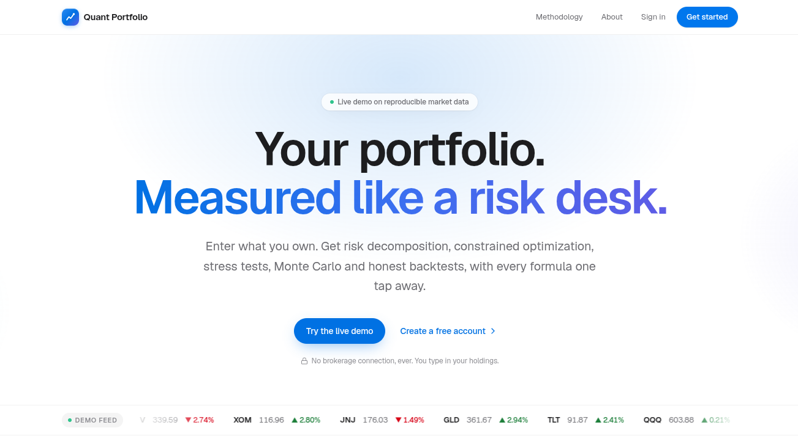
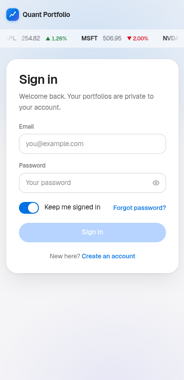
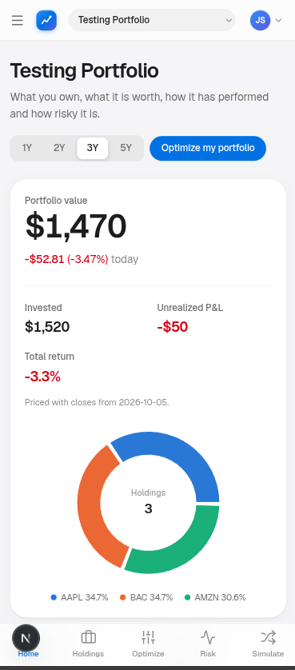
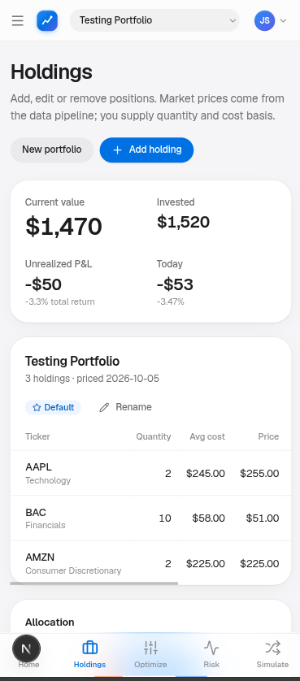
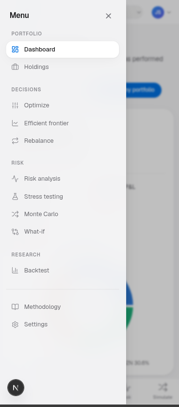
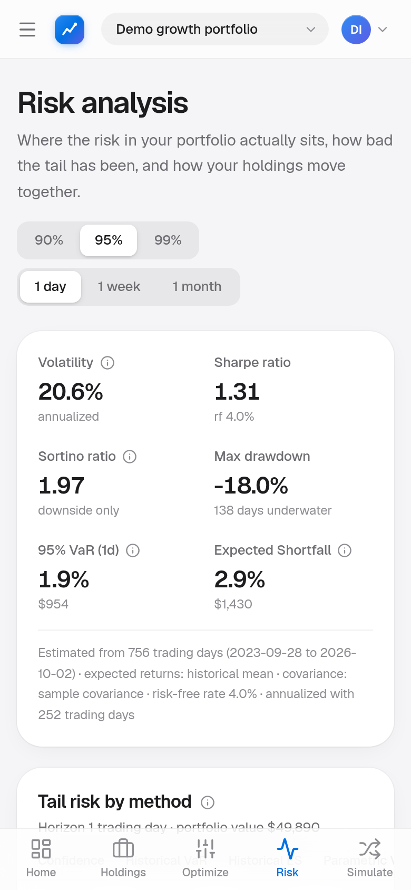
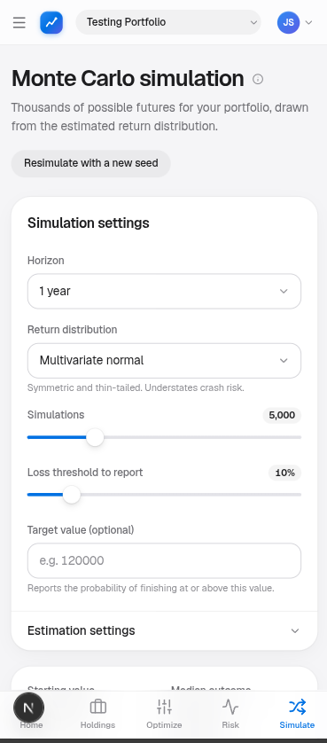
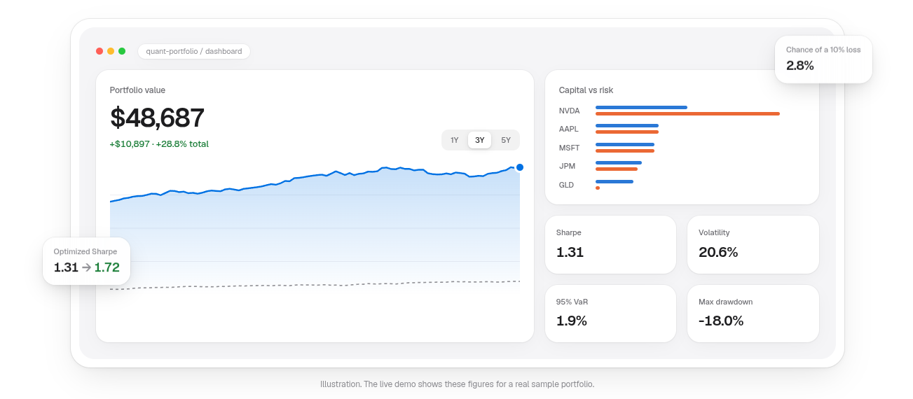
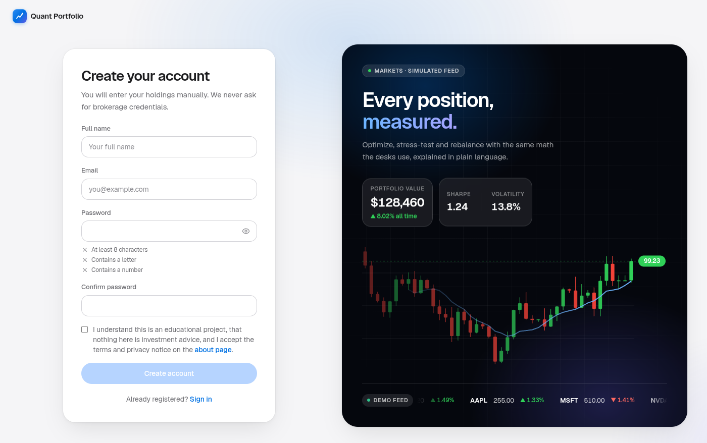
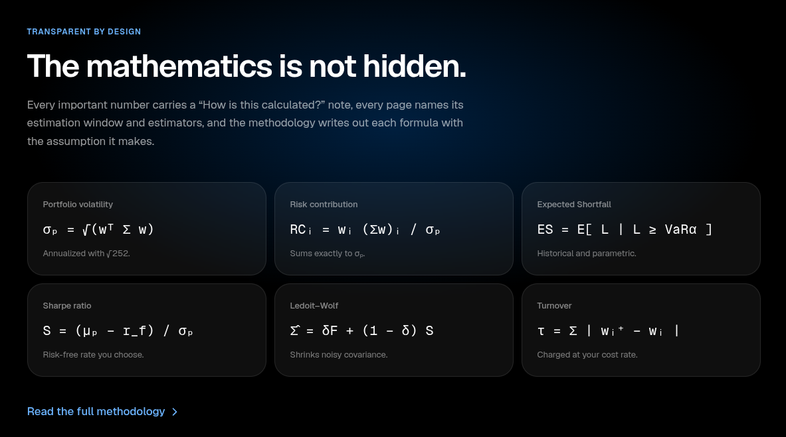

<div align="center">


# Quant Portfolio

### Your portfolio, measured like a risk desk.

A full-stack quantitative portfolio construction and risk platform. Enter what you own and get risk decomposition,<br/>
constrained optimization, stress tests, Monte Carlo simulation and walk-forward backtests, with every formula one tap away.

<br/>


<br/>


<br/>


</div>

---

<p align="center">
  
</p>

---

## 📱 Built for your phone

Designed mobile-first with a clean, Apple-inspired interface: frosted navigation, a native-feeling tab bar, iOS-style controls and charts that stay readable on a small screen.

<table>
  <tr>
    <td align="center" width="33%"></td>
    <td align="center" width="33%"></td>
    <td align="center" width="33%"></td>
  </tr>
  <tr>
    <td align="center"><b>Sign in</b><br/><sub>Secure cookie-based sessions, live ticker on top</sub></td>
    <td align="center"><b>Dashboard</b><br/><sub>Value, P&amp;L, total return and allocation</sub></td>
    <td align="center"><b>Holdings</b><br/><sub>Enter quantity and cost; prices come from the pipeline</sub></td>
  </tr>
  <tr>
    <td align="center"></td>
    <td align="center"></td>
    <td align="center"></td>
  </tr>
  <tr>
    <td align="center"><b>Navigation</b><br/><sub>Portfolio, decisions, risk and research tools</sub></td>
    <td align="center"><b>Risk</b><br/><sub>VaR, Expected Shortfall, risk contribution</sub></td>
    <td align="center"><b>Monte Carlo</b><br/><sub>Thousands of simulated futures, fully configurable</sub></td>
  </tr>
</table>

---

## 🖥️ On the desktop

<table>
  <tr>
    <td width="50%"></td>
    <td width="50%"></td>
  </tr>
  <tr>
    <td align="center"><b>Dashboard at a glance</b><br/><sub>Sharpe, volatility, 95% VaR, max drawdown and capital vs risk</sub></td>
    <td align="center"><b>Sign up</b><br/><sub>Password rules, consent, and an animated candlestick panel</sub></td>
  </tr>
</table>

<p align="center">
  
  <br/><sub><b>Transparent by design:</b> every metric links to the formula behind it.</sub>
</p>

---

## ✨ Highlights

- **Real quantitative engine, not a mock-up.** Mean-variance optimization with SciPy SLSQP, five covariance estimators (sample, Ledoit-Wolf, EWMA, Bayes-Stein, CAPM), VaR and Expected Shortfall, risk parity and a walk-forward backtester.
- **Transparent by design.** Every key number has a "How is this calculated?" explanation, and a methodology page writes out each formula with the assumption behind it.
- **Clean architecture.** The finance engine (`quant/`) imports nothing from the web stack, so the same code runs in the API, in tests, in scheduled jobs and in Jupyter notebooks.
- **Production-minded security.** bcrypt passwords, httpOnly JWT cookies with session revocation, CSRF origin checks, rate limiting, and strict per-user data isolation (another user's portfolio returns 404, never 403).
- **Tested and automated.** About 75 pytest tests asserting financial properties (risk contributions sum to volatility, every optimizer result satisfies its constraints, no look-ahead in backtests), plus a GitHub Actions CI pipeline for lint, tests and type checks.
- **Runs anywhere.** Two terminals with SQLite and no API keys, or `docker compose up` with PostgreSQL.

---

## 🧮 Features

| Module | What it does |
|---|---|
| **Dashboard** | Portfolio value, cost basis, unrealized P&L, allocation, drawdown and plain-language insights |
| **Holdings** | Add, edit and delete positions inline; allocation by asset, sector and type |
| **Optimize** | Minimum variance, maximum Sharpe, target return, risk parity and equal weight, with weight caps, sector caps, cash floor and turnover constraints, plus a trade preview |
| **Efficient Frontier** | Constrained frontier, tangency portfolio and capital market line |
| **Risk** | Risk contribution per holding, correlation matrix, concentration (HHI), historical and parametric VaR/ES, beta and alpha |
| **Stress Test** | Market, sector, rate and energy shocks, historical replays (COVID 2020, 2022 bear market) and custom scenarios with per-holding loss attribution |
| **Monte Carlo** | Normal, Student-t or historical bootstrap simulation with percentile fan chart and simulated VaR/ES |
| **Rebalance** | Drift against a target, threshold rules, cost estimates and an exact share-level trade list |
| **What-If** | Invest more, shock a holding or the market, trim a position, and compare risk before and after |
| **Backtest** | Walk-forward strategy comparison with transaction costs, a benchmark and no-look-ahead checks |
| **Account** | Sign up, email verification, password reset, onboarding, profile and settings |

---

## 🛠️ Tech stack

| Layer | Technologies |
|---|---|
| **Frontend** | Next.js 15 (App Router), React 19, TypeScript, Tailwind CSS, Recharts, SWR, Vitest |
| **Backend** | FastAPI, Pydantic v2, SQLAlchemy 2, bcrypt, PyJWT |
| **Quant engine** | NumPy, pandas, SciPy |
| **Data** | SQLite (default) or PostgreSQL / Supabase |
| **DevOps** | Docker, Docker Compose, GitHub Actions (CI and scheduled data refresh), Ruff |

---

## 🏗️ Architecture

```
Browser
  │
  ├── Next.js 15  (App Router · React 19 · TypeScript · Tailwind · Recharts)
  │     └── proxies /api/* to the backend so the session cookie stays first-party
  │
  ├── FastAPI  (Pydantic validation · cookie JWT auth · rate limits)
  │     └── validate → check ownership → call engine → serialize
  │
  ├── quant/  (NumPy · pandas · SciPy, no web framework)
  │     returns · risk · estimators · optimizer · Monte Carlo
  │     stress scenarios · rebalancing · walk-forward backtest
  │
  └── PostgreSQL / SQLite  ←  jobs/update_market_data.py
                              (the only component that talks to a data provider)
```

The API reads prices from the database and never calls a market-data provider during a request, so a slow provider can't make a page hang.

---

## 📊 About the market data

> [!NOTE]
> **Prices are synthetic by default.** The app ships with a seeded factor-model generator (market and sector factors, rate and oil sensitivities, Student-t noise, and real drawdown episodes pinned to their historical dates), so every figure is reproducible and the project runs without any API key.
>
> **Real data is optional:** set `DATA_SOURCE=yahoo` and the same pipeline, validation and formulas run on real adjusted closes from Yahoo Finance. The app always labels which data source is active, so a simulated number is never presented as a market fact.

---

## 🚀 Quick start

**Requirements:** Python 3.11+ and Node 20+

```bash
# 1. Backend
cd quant-portfolio-platform
pip install -e ".[dev]"
cd backend && uvicorn app.main:app --reload --port 8000
```

```bash
# 2. Frontend (in a second terminal)
cd quant-portfolio-platform/frontend && npm install && npm run dev
```

Open **http://localhost:3000** and click **Try the live demo** for an instant sample portfolio. Interactive API docs are at **http://localhost:8000/docs**.

<details>
<summary><b>🐳 Run with Docker</b></summary>

```bash
cd quant-portfolio-platform
cp .env.example .env
docker compose up --build
```

Starts PostgreSQL, the API on `:8000`, the web app on `:3000` and a one-time seed job.
</details>

<details>
<summary><b>🧪 Run the tests</b></summary>

```bash
cd quant-portfolio-platform
pytest                                  # engine, API, auth and isolation tests
cd frontend && npm test                 # frontend unit tests
cd frontend && npx tsc --noEmit         # type check
```
</details>

For a step-by-step guide including Windows commands, see [RUN_LOCALLY.md](quant-portfolio-platform/RUN_LOCALLY.md).

---

## 📁 Project structure

```
quant-portfolio-platform/
├── quant/            # Framework-free finance engine
│   ├── data/         #   asset universe, trading calendar, providers, synthetic generator
│   ├── features/     #   returns and annualization
│   ├── risk/         #   metrics, VaR/ES, drawdown, what-if
│   ├── optimization/ #   covariance estimators and SLSQP optimizer
│   ├── simulation/   #   Monte Carlo
│   ├── stress/       #   predefined and custom scenarios
│   ├── rebalancing/  #   drift, turnover, trade lists
│   ├── backtest/     #   walk-forward engine
│   └── factors/      #   market beta and attribution
├── backend/          # FastAPI app: routes, schemas, services, models, tests
├── frontend/         # Next.js app: pages, charts, UI components
├── jobs/             # Scheduled market-data refresh
├── database/         # SQL migrations and seeder
├── notebooks/        # Jupyter notebooks driving the engine directly
└── docs/             # Architecture, API, methodology, deployment guides
```

---

## 📚 Documentation

| Doc | Contents |
|---|---|
| [Architecture](quant-portfolio-platform/docs/architecture.md) | Layers, data flow, design decisions |
| [API reference](quant-portfolio-platform/docs/api.md) | Every endpoint with request and response shapes |
| [Methodology](quant-portfolio-platform/docs/methodology.md) | Formulas, conventions and assumptions |
| [Development](quant-portfolio-platform/docs/development.md) | Local setup, tests, conventions |
| [Deployment](quant-portfolio-platform/docs/deployment.md) | Docker, managed Postgres, production checklist |

---

## ⚠️ Disclaimer

This is an analysis and educational tool. It is not investment advice, it does not connect to any brokerage, and it never places trades.

## 📄 License

Released under the [MIT License](quant-portfolio-platform/LICENSE).

<div align="center">
<br/>
<sub>Built by <b>Jose</b> · If you found this interesting, consider giving it a ⭐</sub>
</div>
